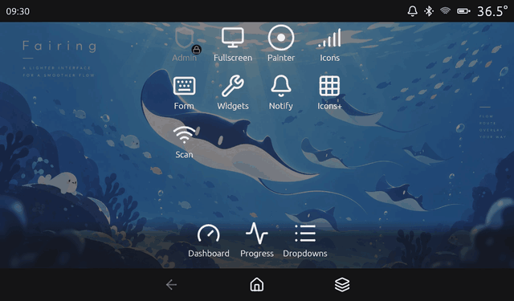
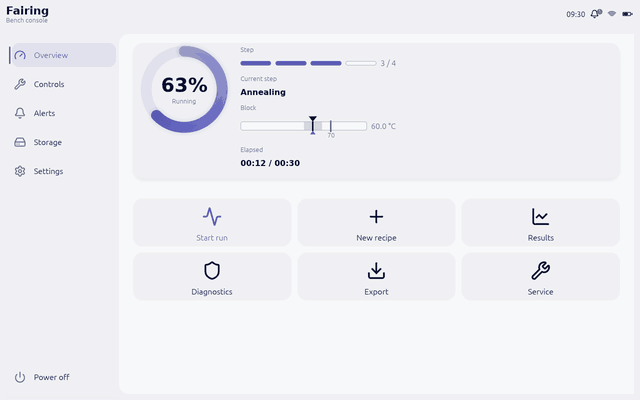
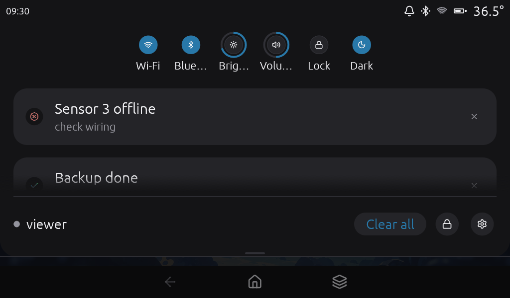
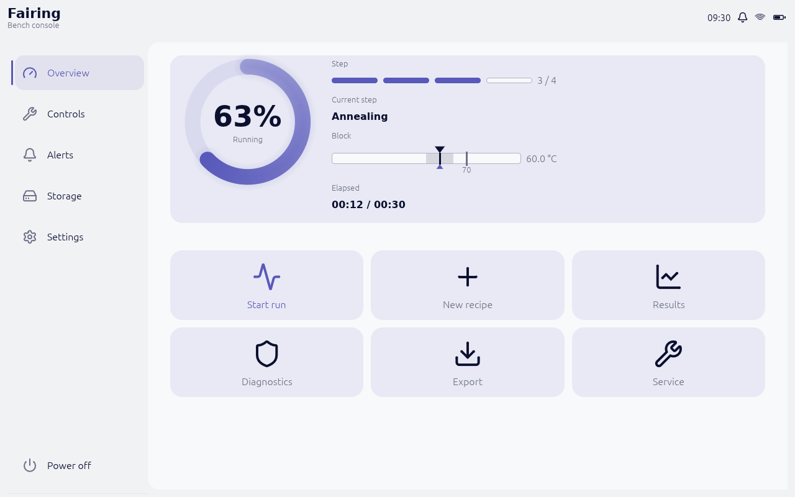
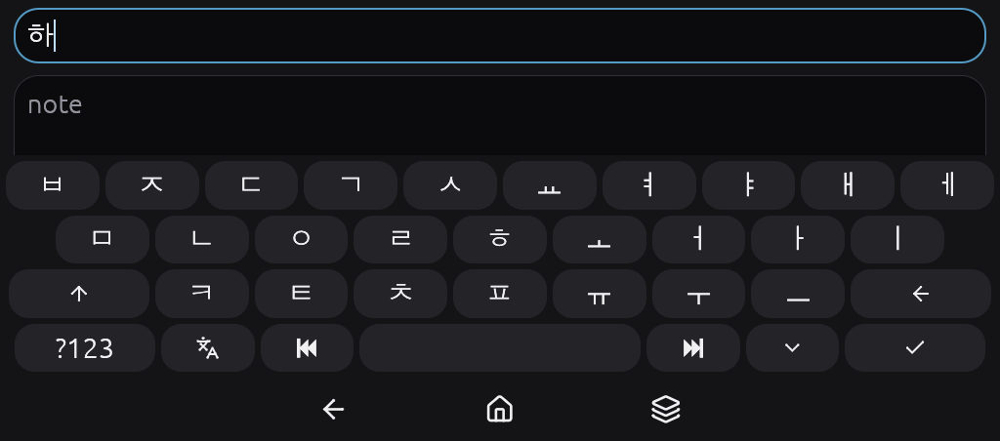
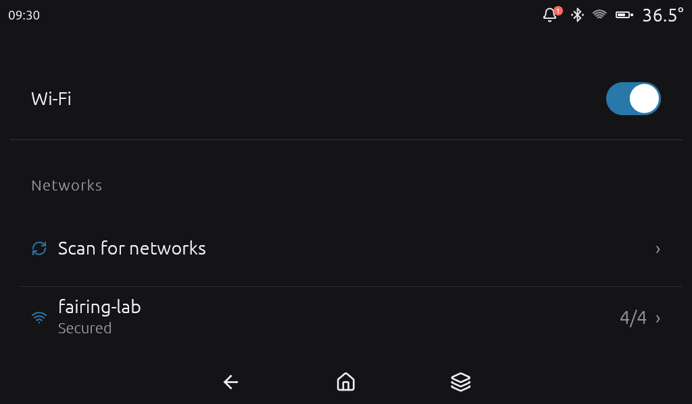
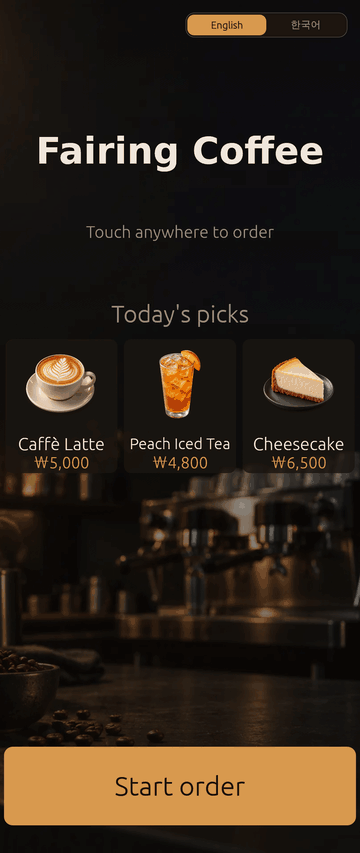
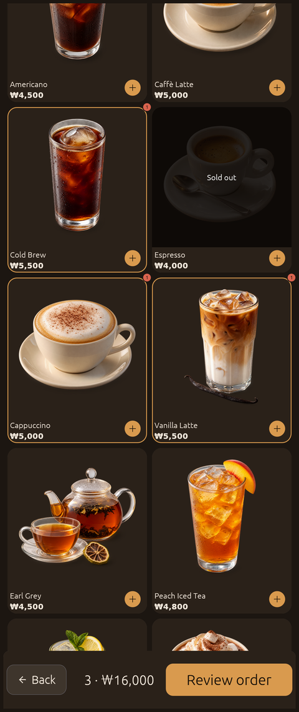
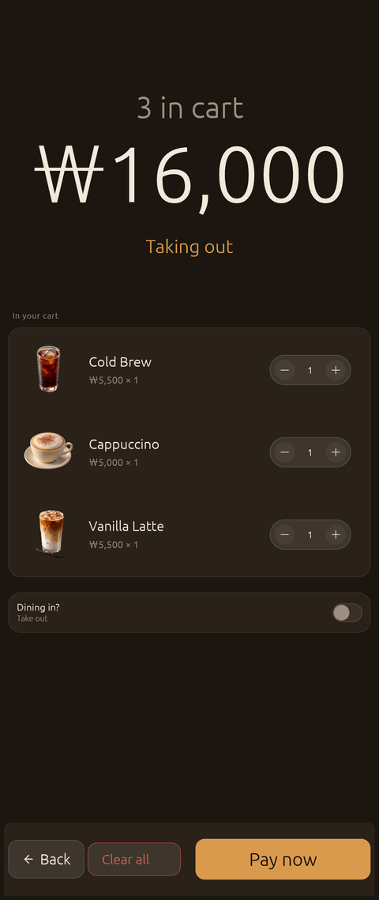

# fairing

**A touchscreen shell for embedded devices, built on [egui](https://github.com/emilk/egui).**

Status bar, pull-down shade, desktop, virtual screens, navigation bar, on-screen
keyboard, local access control and device settings — all inside **one process and
one egui frame loop**. It is not an OS, not an app launcher, not a window manager.

You write screens as egui closures. fairing owns everything around them: layout
rectangles, touch targets sized in millimetres, gestures, transitions, gates and
repaint policy.

<table>
  <tr>
    <td width="50%"></td>
    <td width="50%"></td>
  </tr>
  <tr>
    <td>An icon zooms open, a screen pushes over it and pops off, home closes it (<code>demo</code>)</td>
    <td>A split shade: each half pulled open as a card on frosted glass (<code>console</code>)</td>
  </tr>
  <tr>
    <td></td>
    <td></td>
  </tr>
  <tr>
    <td>The same shade as a curtain: tiles, notifications, a footer (<code>demo</code>)</td>
    <td>A bench console built from <code>layout</code> and <code>widgets</code> calls only (<code>console</code>)</td>
  </tr>
  <tr>
    <td></td>
    <td></td>
  </tr>
  <tr>
    <td>Two-set Hangul with composition on the on-screen keyboard (<code>demo</code>)</td>
    <td>One of the built-in settings screens (<code>demo</code>)</td>
  </tr>
</table>

```rust
shell.add(
    screen("dashboard", |ui: &mut egui::Ui, cx: &mut Cx| {
        ui.heading("Dashboard");
        if ui.button("Settings").clicked() {
            cx.open("settings.home");
        }
    })
    .title("Dashboard")
    .icon(icon::GAUGE)
    .desktop(),
);
```

## Why

Device UIs keep rebuilding the same shell. Every kiosk, every panel, every piece of
lab equipment grows its own status bar, its own back button, its own "are you sure"
dialog and its own idea of how big a finger is — and each one gets the hard parts
slightly wrong. fairing is that shell, once, with the hard parts already decided:

- **Touch targets are physical.** Sizes resolve through panel millimetres, not
  pixels, so the same code lands correctly on a 4-inch panel and a 27-inch one.
- **No locks.** Threads talk over channels; the UI thread never blocks. A build
  gate (`xtask sync-check`) enforces it.
- **Little is hard-wired.** Every chrome surface takes configuration and
  declarations; the bars, toasts, banners, keyboard keys, the shade's tiles and panel,
  the desktop cells, the lock screen, the unlock prompt, the recent screens and every
  widget also take a layout or a painter you supply — without forking the crate.
- **Gestures are one engine.** Edge swipes, flings, long presses and the shade all
  arbitrate in one place, so nested scrolling and hand-off behave — and so do the thin
  gesture handles you put on the side and bottom edges, swiped the way One Hand Operation+
  handles are, and the gesture regions you write yourself, such as part of a screen used as a
  trackpad.

## What you get

| Surface | What it does |
|---|---|
| Status bar | Clock, Wi-Fi, Bluetooth, battery, notification badge, your own items |
| Shade | Quick-settings tiles and the notification list, as one panel or split in two; drawn down as a curtain or arriving as a floating card on frosted glass; peek when the bar is hidden |
| Desktop | Icon grid with pages, dock, badges, wallpaper |
| Screens | A stack per pane, icon-zoom and push/pop transitions, lifecycle callbacks |
| Two panes | Two screens side by side (or stacked) with a divider that follows the finger and keeps each screen's minimum; the pane last touched has the focus |
| Recent screens | A card for every live task: tap to bring it back, swipe up to close it, put it beside the screen on show, or close them all |
| Navigation bar | Buttons or edge gestures, your own items |
| Notifications | Center, toasts, heads-up — postable from any thread |
| On-screen keyboard | Numpad, QWERTY and Hangul (two-set) with composition |
| Settings | Eleven built-in screens, added with one call and narrowed, replaced or dropped from there |
| Access control | Gates on every screen, action, tile and setting key; an unlock prompt with a PIN pad, a pattern, a password card or a badge-reader wait, a lock screen, temporary unlocks and session timeouts. You own the credential check, through one `Authenticator` trait |
| Screen layout | Pages with a pinned action bar, section cards, grids, a rail with a list/detail split, tab bars and expandable rows, all drawn from theme tokens |
| Widgets | 23 touch widgets, from buttons, switches and sliders to a dropdown, a wheel picker, a progress ring, a PIN pad and a pattern pad. They live in [`fairing-widgets`](crates/fairing-widgets) and work without the shell |

78 vector icons ship with it, plus six parametric ones (Wi-Fi strength, battery
level and friends) that redraw from state.

## Quick start

fairing is not on crates.io yet. Until it is, depend on this repository:

```toml
[dependencies]
fairing = { git = "https://github.com/shim9610/fairing", features = ["runner-x11"] }
egui = "0.36"   # the same minor as fairing's; or name it through `fairing::egui`
```

```rust
use fairing::prelude::*; // the shell, the declarations, Cx, the events, the icons, egui

fn main() -> fairing::Result<()> {
    let config = ShellConfig::load("/etc/myapp/fairing.toml")?; // defaults if absent
    let options = fairing::runner::Options::default();          // fullscreen kiosk

    fairing::runner::run_shell(options, move |ctx| {
        let mut shell = Shell::builder(config)
            .services(Services::builder().build())               // real clock, null everything else
            .physical_mm(154.0, 86.0)                            // the panel's visible area: millimetres become real
            .build(ctx)?;

        // The built-in settings screens: `settings.home` and the ones under it. Wi-Fi,
        // Bluetooth, network and power join only when a backend has them.
        fairing::settings::add_all(&mut shell, &fairing::settings::SettingsConfig::default());

        shell.add(
            screen("dashboard", |ui: &mut egui::Ui, cx: &mut Cx| {
                ui.heading("Dashboard");
                if ui.button("Settings").clicked() {
                    cx.open("settings.home");
                }
            })
            .title("Dashboard")
            .icon(icon::GAUGE)
            .desktop(),
        );
        shell.add(status_item("temp", Slot::Right, |ui, _cx| {
            ui.label("36.5 °C");
        }));
        shell.add(nav_item("kbd", |ui, _cx| {                           // drawn where [nav_bar] items names it
            let _ = ui.button("⌨");
        }));
        shell.remove("status.bluetooth"); // built-ins go away by id

        Ok(shell)
    })
}
```

```toml
# /etc/myapp/fairing.toml
[nav_bar]
items = ["back", "home", "kbd"]   # a nav item is drawn only where this list names it
```

The same app is [`examples/hello.rs`](crates/fairing/examples/hello.rs), in a window and
with the nav bar list set in code: `cargo run -p fairing --example hello --features runner-x11`
runs it, and it shares nothing with the other examples, so it can be copied whole.

The `runner-x11` feature runs it on a Linux desktop as well as under Wayland; leave
the runner off and drive `Shell::frame` yourself to embed the shell in an eframe app
you already have.

Three things the defaults cannot know. The shell logs a warning at startup for each
until you tell it:

- **The panel's size.** Without `.physical_mm(w, h)` (or a display backend that reports
  it) the shell assumes a density, and the "13 mm" touch targets are a guess.
- **Fonts.** The crate carries no face of its own, on purpose: which faces a device shows,
  and under what licence, is the device's call. egui's built-in face has one weight and Latin
  letters only: titles come out flat, and Hangul or `₩` come out as boxes. The shell warns when there is no bold, and
  when its own language's letters are missing. Give it your faces with
  `.font(FontSource::from_path(..)?)` — [guide 01 §4](docs/guide/01-getting-started.md#4-a-minimal-app)
  shows the bold and the Korean one.
- **Which nav items to draw.** A `nav_item` appears only where `[nav_bar] items` lists
  its id.

## Making it yours

Three rungs, from cheapest to most invasive. Each one only exists because the one
below it could not express something.

**1 — Configuration.** A TOML file decides what appears and where.

```toml
[status_bar]
right = ["status.clock", "status.wifi", "status.battery"]

[overlay]
tiles = ["tile.wifi", "tile.hopper", "tile.brightness"]   # yours can sit between built-ins
tile_columns = 3

[nav_bar]
enabled = false          # no bar; screens carry their own back button

[theme.palette]
primary = "#2fe09b"      # role colours, including #RRGGBBAA
```

**2 — Declarations.** Screens, actions, status items, nav items and tiles are all
`shell.add(...)`, all removable by id. Tiles can be a toggle, a slider, an action,
a read-only status, or a row of gauges you describe:

```rust
shell.add(
    tile("tile.hopper", TileKind::Gauges {
        rows: vec![
            Gauge::new("hopper.a", "Resin A").color(ColorRole::Primary),
            Gauge::new("hopper.b", "Resin B").color(ColorRole::Warning),
            Gauge::new("hopper.c", "Solvent").read_only(true),
        ],
        label_width: 96.0,
    })
    .label("Hoppers")
    .icon(icon::GAUGE),
);
```

**3 — Painters.** When the shape itself is wrong, take the brush. The shell keeps
the rectangle, the gate check and the hit test; you draw.

| Builder | What you take over |
|---|---|
| `.theme(Theme)` | Palette, metrics and motion tokens in full |
| `.status_bar_painter(\|ui, bar\| ..)` · `.nav_bar_painter(..)` | The whole bar |
| `.nav_bar_layout(..)` · `.status_bar_layout(..)` | Where the nav bar's and the status bar's items go |
| `.toast_painter(..)` · `.heads_up_painter(..)` (and `_layout`) | Each toast's card and the banner, and where they go |
| `.osk_key_painter(..)` · `.osk_key_layout(..)` | Each keyboard key, and where the keys go |
| `.shade_tile_painter(..)` · `.shade_panel_painter(..)` · `.shade_tile_layout(..)` | Each quick-settings tile and the panel under them, and where the tiles go |
| `.lock_screen_painter(..)` · `.unlock_prompt_painter(..)` | The lock screen's ground and clock, and the unlock prompt's backdrop and card; the keypad stays the shell's |
| `.recents_card_painter(..)` · `.recents_ground_painter(..)` | Each recent screen's card and the ground under them; the carousel stays the shell's |
| `.widget_painters(WidgetPainters::new().button(..).switch(..))` | Each kind of widget, wherever it is drawn; the widget keeps its press, value and motion |
| `.gesture_handle_painter(..)` | Each gesture handle's strip and the arrow while it is swiped; the strips and the gestures stay the shell's |
| `impl GestureRegion` · `Shell::add_gesture_region(..)` | A stretch of the glass of your own, such as a trackpad: where it is, what its touches do, how it looks; the guard and the touch's delivery stay the shell's |
| `.slot_painter(\|ui, slot\| ..)` | Every desktop cell |
| `Wallpaper::Painter(..)` | The background |
| `tile_panel(id, height, \|ui, cx\| ..)` | A quick-settings tile's expanded row |

**Backends.** The shell reaches the hardware only through traits — clock, power,
Wi-Fi, Bluetooth, display, audio, network and device info — and ships nothing but
`Null` defaults and a `Mock` simulator. Your device speaks sysfs, a vendor SDK, D-Bus
or a PLC protocol; plug in your own implementations, and anything the shell has no
slot for as a custom backend. It is polled every frame like the others, and screens
reach it by its type:

```rust
let services = Services::builder()
    .display(Backlight::open("/sys/class/backlight/panel")?) // yours
    .custom(DoorSensor::spawn())                              // yours, no slot needed
    .build();

// in a screen
if let Some(door) = cx.services.custom::<DoorSensor>() {
    ui.label(if door.is_open() { "Door open" } else { "Door closed" });
}
```

**No files behind your back.** The shell writes none. A setting someone changes reaches you as
`ShellEvent::SettingChanged`, to keep wherever your device keeps such things, and
`Shell::restore_settings` puts what you kept back at start.

## Examples

The windowed examples run on a Linux desktop with `--features runner-x11`, and all but `hello`
take `--size=WxH`. All of them but `hello` and `motion_lab` take `--tour <dir>`, which drives the
example through a script and writes a PNG at each step. Add `--record` and the tour
runs on a fixed 60 Hz clock, however slowly the machine draws, and writes the frames
of its animated stretches as well. The screenshots and animations on this page come
from those tours, and `tools/readme-gifs.sh` rebuilds the animations. `bench` is
headless.

| Example | What it shows |
|---|---|
| `hello` | The smallest complete app: the quick start above as a file that stands alone, to copy into a new project |
| `demo` | Everything, on a 1024×600 panel |
| `console` | A bench instrument rather than a phone: a rail down the left joined to the status bar, five pages with their own transitions, and the shade split into two floating cards. 1280×800 |
| `kiosk` | A production-shaped café ordering flow, portrait 1080×2560, laid out and styled almost entirely by the crate — what it still draws itself (photo scrims, a cart stepper) is listed in its header. `--layout=portrait\|counter\|compact` puts the same code on three devices, and a switch on its attract screen changes the language of every screen at run time |
| `custom_chrome` | The same shell with a hand-drawn status bar, circular desktop badges, a procedural wallpaper, no nav bar, a gauges tile the crate draws from a declaration, and a jog-pad tile it knows nothing about |
| `motion_lab` | Every `[motion]` token on a slider, with looped playback and a frame-time graph. Exports the tuned values as TOML |
| `palette_sheet` | One frame with every control on it, for comparing palettes |
| `bench` | p50/p95 frame times per scenario |

```sh
cargo run -p fairing --features runner-x11 --example demo -- --size=1024x600
cargo run -p fairing --features runner-x11 --example console -- --size=1280x800
```

<table>
  <tr>
    <td width="33%"></td>
    <td width="33%"></td>
    <td width="33%"></td>
  </tr>
  <tr>
    <td colspan="3">The <code>kiosk</code> example on a 1080×2560 portrait panel, laid out and styled almost entirely by the crate. The language switch on the attract screen writes the shell's <code>ui.locale</code> setting, and every screen follows that setting from the next frame. The product photos are the example's own assets.</td>
  </tr>
</table>

Both run in English. The demo's keyboard opens on QWERTY; its tour switches to
two-set Hangul to show composition, and `[osk] layout = "hangul"` in `demo.toml`
starts there. The kiosk switches language at run time, as shown above, and doubles
as the localisation harness: Korean puts the same layout code through strings
roughly half as long. `--lang=ko` starts it in Korean.

## Testing

`fairing::testing::Harness` runs frames with no window, no GPU and no
dev-dependencies. It reports real geometry (`icon_rect`, `item_rect`, `tile_rect`,
`key_rect`) so tests tap, drag, fling and hold at the places the shell actually
drew, instead of re-deriving layout maths.

```rust
let mut h = Harness::new(config, Services::null())?;
h.frames(2);
let cell = h.shell.overlay().tile_rect("tile.wifi").expect("tile");
h.tap(cell.center());
```

The crate's own tests also read a little internal state — the shell's registry and
gesture engine, the shade's scrim alpha, a screen's layer id. Those accessors are public
but `#[doc(hidden)]`: your tests may use them too, but they are not part of the API and
any release, patch releases included, may change them.

Over a thousand tests pass today. `cargo run -p xtask --locked -- audit --strict`
runs the full gate — formatting, clippy with `-D warnings`, tests (the guide's code blocks
included), docs, duplicate
versions, a dependency allow-list, `cargo-audit`, `cargo-deny`, licence notices,
generated-file checks, an aarch64 cross-check (`cargo check --target`) and the no-locks
scan. CI runs all fourteen stages on every push and pull request.

## Platforms

The target is embedded Linux — Ubuntu Core with `ubuntu-frame`, `cage` or `weston` —
on x86_64 and aarch64, drawing with OpenGL ES 2 through eframe's `glow` backend. The
audit type-checks the aarch64 build on every run; nothing runs it on aarch64 hardware. Only Linux is built, run and tested in CI — macOS and Windows should build, as
eframe does, but nothing checks it. The declared minimum Rust version is 1.95; CI builds
with 1.99.

## Not yet

Honest gaps, not a roadmap:

- **Two built-in languages.** The shell's own text comes in English and Korean; any other
  language is a table you add with `ShellBuilder::translations`.
- **Two bars.** There is the status bar and the nav bar. Bars on other edges, rows of bars
  and the `[[bar]]` TOML section that would declare them come after 0.1; a band of your own
  goes inside your screens (`layout::action_bar`, `layout::tab_bar`).
- **No accessibility tree and no right-to-left layout.** Nothing is reported to a screen
  reader, and layouts run left to right.

## Layout

| Crate | Role |
|---|---|
| `fairing` | The shell. `fairing-widgets`, `egui`, `serde`, `toml` and `log`; features `mock`, `overlay`, `osk`, `brand` and `settings` on by default, `runner`/`runner-x11` (eframe) and `chrono` optional |
| `fairing-widgets` | The element layer, usable without the shell: touch widgets, theme tokens, the `du`/`mm` unit system, icons and motion. `egui`, `serde` and `log` |
| `xtask` | The audit, the dependency allow-list, the icon compiler, the licence notices |

## Documentation

The integrator guide lives in [`docs/guide/`](docs/guide/README.md). Read
[01 Getting started](docs/guide/01-getting-started.md) →
[02 Screens](docs/guide/02-screens.md) → [03 Chrome](docs/guide/03-chrome.md) and
you have a running device UI. The guide index carries a task-to-page table. The API
reference will be on docs.rs once the crates are published; until then,
`cargo doc --open` builds it. What changed is in [`CHANGELOG.md`](CHANGELOG.md).

How the crate is put together is in [`docs/architecture.md`](docs/architecture.md). Where it
stands, what comes after 0.1 and the limits it has today are in
[`docs/roadmap.md`](docs/roadmap.md).

## Licence

MIT, see [`LICENSE`](LICENSE). Third-party notices are in [`THIRD_PARTY.md`](THIRD_PARTY.md).
